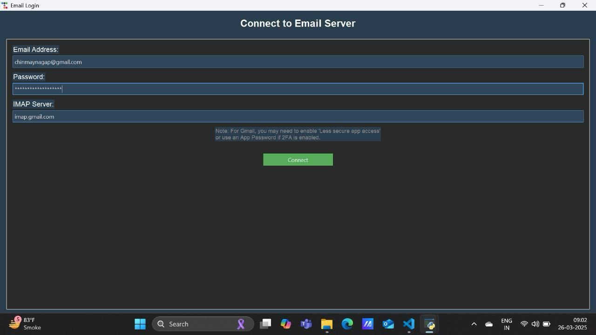
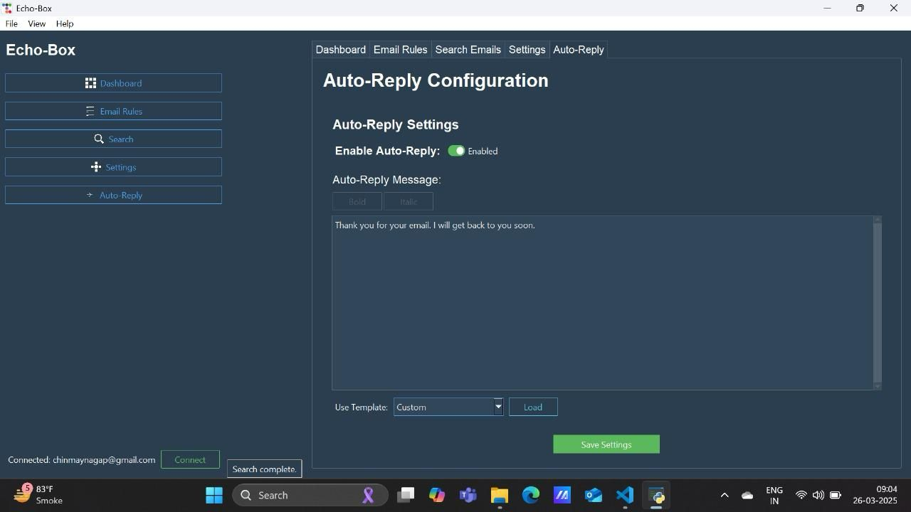
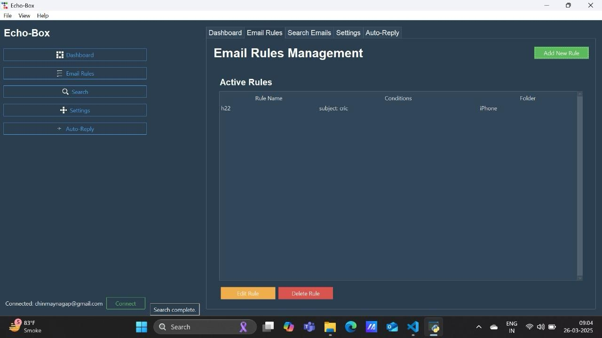
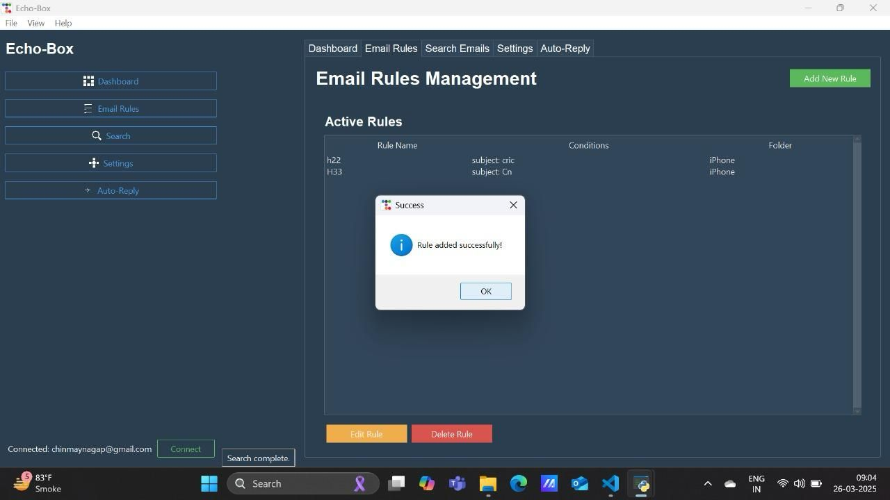
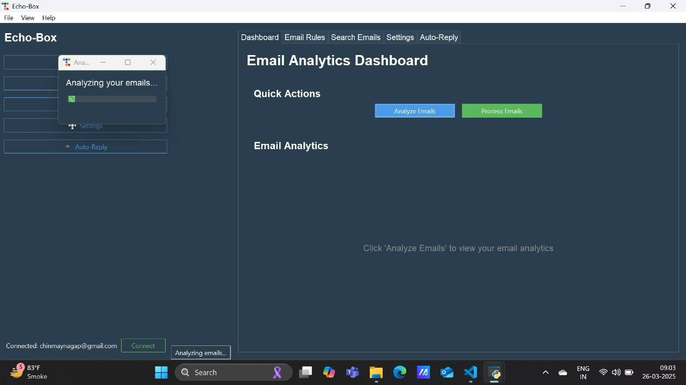
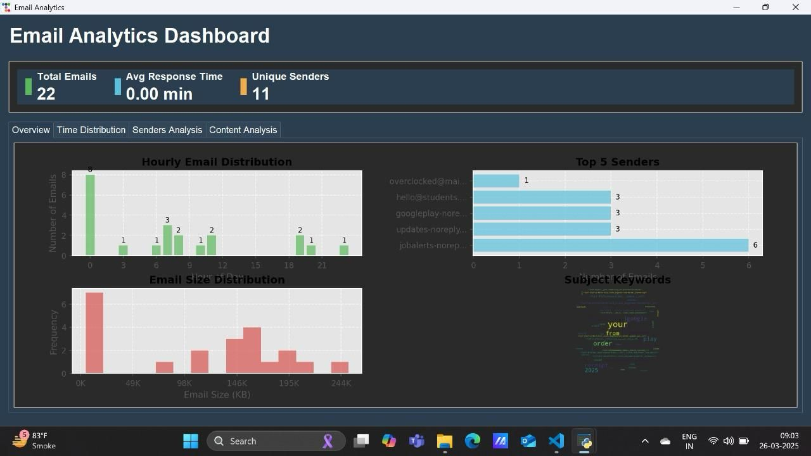
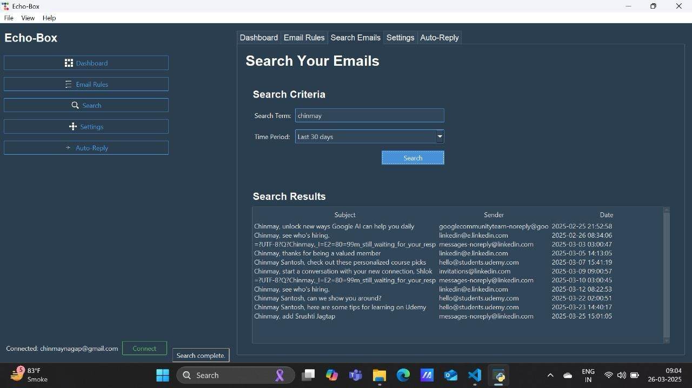
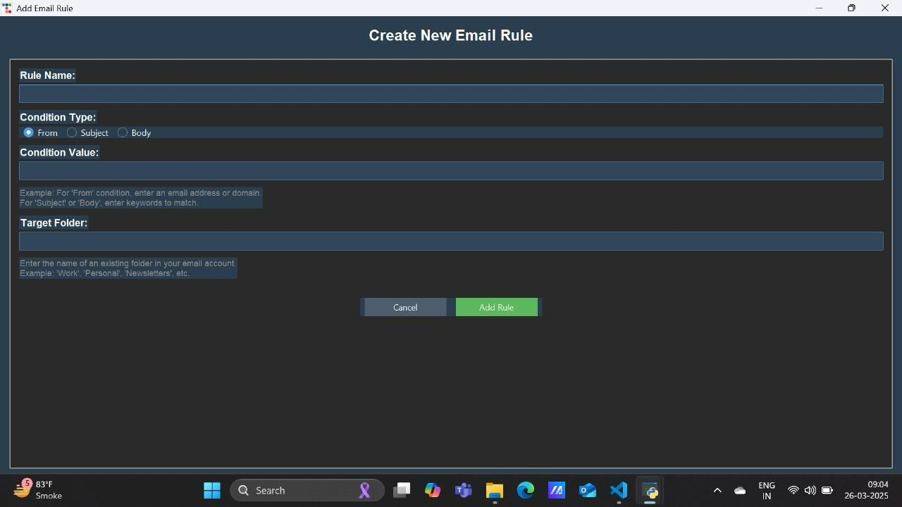
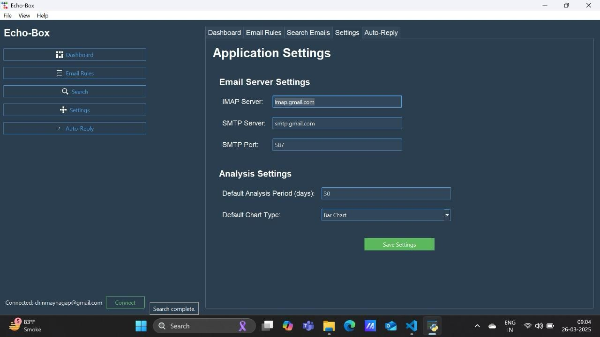

# ✉️ Echo-Box – Smart Email Organizer & Analytics App

> A desktop GUI tool that organizes, auto-replies, and analyzes emails using IMAP/SMTP protocols with modern visuals and rule-based automation.


---
## 🔥 Features

✅ Connect to Gmail using IMAP  
✅ Visual Dashboard with Hourly Distribution, Keyword Clouds, Email Sizes  
✅ Auto-reply feature with templates  
✅ Rule-based auto-sorting to folders  
✅ Search by subject keyword  
✅ Modern dark-themed GUI  
✅ Responsive sidebar navigation

---

## 📸 Screenshots

|--------------|----------------|------------|
|  |  |  |
|-----------|------------------|-----------|
|  |  |  |
|-----------|------------------|-----------|
|  | | |
|-----------|
|  |


---

## 🛠️ Tech Stack

| Component      | Details                          |
|----------------|----------------------------------|
| Language       | Python 3.10+                     |
| GUI Framework  | `Tkinter`, `ttkbootstrap`        |
| Email Handling | `imaplib`, `smtplib`             |
| Visualization  | `matplotlib`, `wordcloud`        |
| Assets         | `Pillow` for dynamic icons       |

---

## 📦 Installation

Install dependencies:

```bash
pip install ttkbootstrap matplotlib wordcloud pillow
```

---

## 🚀 How to Run

1. Clone the repository:

```bash
git clone https://github.com/Rohan143-mp/echo-box.git
cd echo-box
```

2. Run the app:

```bash
python "Echo Box.py"
```

---

## 🔒 Gmail Setup

To connect successfully:
- IMAP must be enabled: [Enable IMAP in Gmail](https://mail.google.com/mail/u/0/#settings/fwdandpop)
- If using 2FA: Use an [App Password](https://support.google.com/mail/answer/185833)

---

## 📁 Project Structure

```
echo-box/
├── Echo Box.py
├── screenshots/
│   ├── 1.jpg
│   ├── 2.jpg
│   └── ...
├── email_rules.json         # Generated at runtime
├── auto_reply_settings.json # Generated at runtime
└── README.md
```

---

## 👨‍💻 Author

Developed by **Rohan Pednekar** as part of a mini-project.  
Design inspired by modern productivity dashboards.
